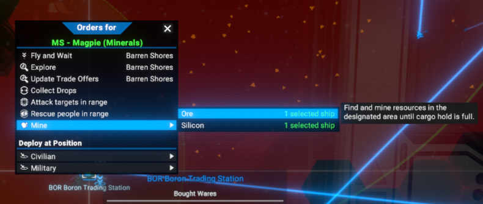
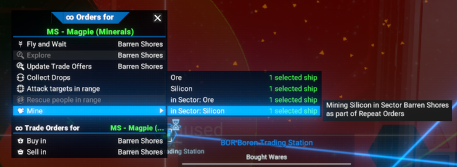
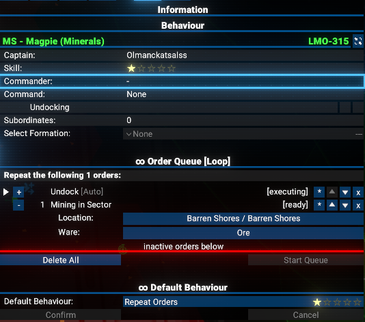

# Mining in Sector for Mimic Repeat Orders

Simple mining routine for player owned ships in sector to be managed by Repeat Orders

## Features

- Simple gathering of resources in the desired sector.
- Can't be initiated out of Repeat Orders.
- Mimic behavior is not mandatory, but `Mimic Repeat Orders` mod is required.

## Limitations

- Works only for player owned ships.
- Can't be initiated out of Repeat Orders.

## Requirements

- `X4: Foundations` 7.60 or newer (tested on 7.60 and 8.00).
- `Mod Support APIs` by [SirNukes](https://next.nexusmods.com/profile/sirnukes?gameId=2659) to be installed and enabled. Version `1.93` and upper is required.
  - It is available via Steam - [SirNukes Mod Support APIs](https://steamcommunity.com/sharedfiles/filedetails/?id=2042901274)
  - Or via the Nexus Mods - [Mod Support APIs](https://www.nexusmods.com/x4foundations/mods/503)
- `Mimic Repeat Orders` mod by [Chem O`Dun](https://next.nexusmods.com/profile/ChemODun?gameId=2659) to be installed and enabled. Version `1.10` and upper is required.
  - It is available via Steam - [Mimic Repeat Orders](https://steamcommunity.com/sharedfiles/filedetails/?id=3599279973)
  - Or via the Nexus Mods - [Mimic Repeat Orders](https://www.nexusmods.com/x4foundations/mods/1875)

## Installation

You can download the latest version via Steam client - [Mining in Sector for Mimic Repeat Orders](https://steamcommunity.com/sharedfiles/filedetails/?id=3602563805)
Or you can do it via the Nexus Mods - [Mining in Sector for Mimic Repeat Orders](https://www.nexusmods.com/x4foundations/mods/1880)

## Usage

Simple use the usual context menu for mining, i.e. select appropriate ship and press right button on appropriate sector. These menu will contain the usual mining options and the new ones.

### Mining Context Menu

When you right-click on a sector in the map view, you will see the context menu with mining options.

#### Default Context Menu

#### Context Menu with Mod

### Result of Selection appropriate Option

## Video

[Video demonstration of the Mining in Sector for Mimic Repeat Orders. Version 1.00](https://www.youtube.com/watch?v=hfOSsG4Q6Ck)

## Credits

- Author: Chem O`Dun, on [Nexus Mods](https://next.nexusmods.com/profile/ChemODun/mods?gameId=2659) and [Steam Workshop](https://steamcommunity.com/id/chemodun/myworkshopfiles/?appid=392160)
- *"X4: Foundations"* is a trademark of [Egosoft](https://www.egosoft.com).

## Acknowledgements

- [EGOSOFT](https://www.egosoft.com) — for the X series.
- [SirNukes](https://next.nexusmods.com/profile/sirnukes?gameId=2659) — for the Mod Support APIs that power the UI hooks.
- [Forleyor](https://next.nexusmods.com/profile/Forleyor?gameId=2659) — for his constant help with understanding the UI modding!

## Changelog

### [1.00] - 2025-11-09

- Added
  - Initial public version
