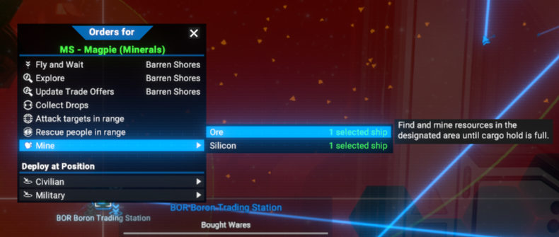
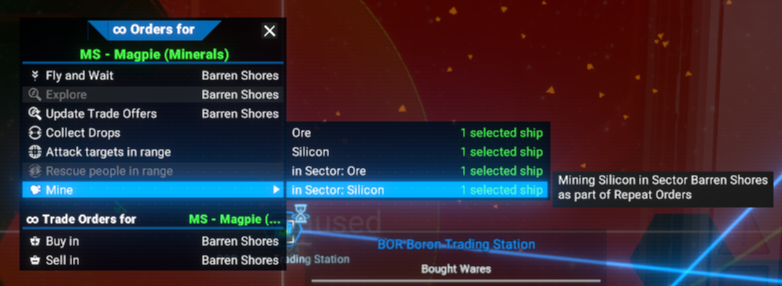
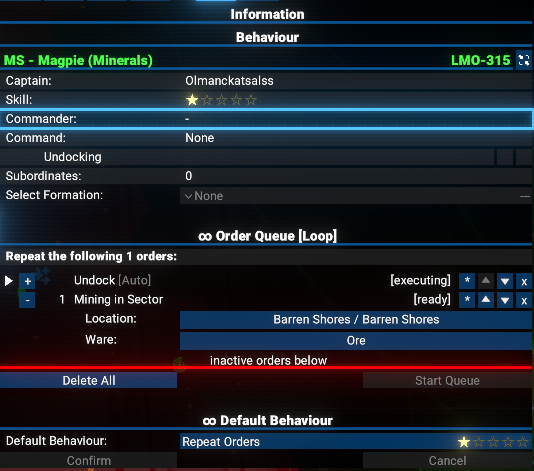
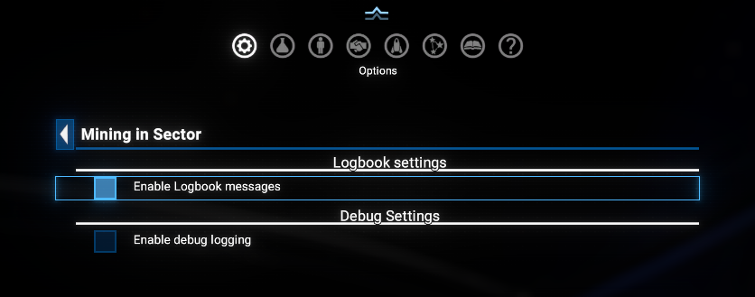

# Mining in Sector for Mimic Repeat Orders

Simple mining routine for player owned ships in sector to be managed by Repeat Orders

## Features

- Simple gathering of resources in the desired sector.
- Can't be initiated out of Repeat Orders.
- Mimic behavior is not mandatory, but `Mimic Repeat Orders` mod is required.

## Limitations

- Works only for player owned ships.
- Can't be initiated out of Repeat Orders.
- Mod versions 1.xx are compatible only with game versions 7.60 and 8.00.
- Mod versions 2.xx are compatible with game version 9.00 and upper.
- Mod version 2.00 is available only on Nexus Mods, not on Steam Workshop (due to its limitation).

## Requirements

- `X4: Foundations` 7.60 or newer (tested on 7.60 and 8.00).
- `Mod Support APIs` by [SirNukes](https://next.nexusmods.com/profile/sirnukes?gameId=2659) to be installed and enabled. Version `1.93` and upper is required.
  - It is available via Steam - [SirNukes Mod Support APIs](https://steamcommunity.com/sharedfiles/filedetails/?id=2042901274)
  - Or via the Nexus Mods - [Mod Support APIs](https://www.nexusmods.com/x4foundations/mods/503)
- `Mimic Repeat Orders` mod by [Chem O\`Dun](https://next.nexusmods.com/profile/ChemODun?gameId=2659) to be installed and enabled. Version `1.10` and upper is required.
  - It is available via Steam - [Mimic Repeat Orders](https://steamcommunity.com/sharedfiles/filedetails/?id=3599279973)
  - Or via the Nexus Mods - [Mimic Repeat Orders](https://www.nexusmods.com/x4foundations/mods/1875)
- `Options Helper` mod by [Chem O\`Dun](https://next.nexusmods.com/profile/ChemODun?gameId=2659), to provide the in-game Extension Options menu. Version `1.00` and upper is required.
  - It is available via Steam - [Options Helper](https://steamcommunity.com/sharedfiles/filedetails/?id=3715253556)
  - Or via the Nexus Mods - [Options Helper](https://www.nexusmods.com/x4foundations/mods/2089)

## Installation

You can download the latest version via Steam client - [Mining in Sector for Mimic Repeat Orders](https://steamcommunity.com/sharedfiles/filedetails/?id=3602563805)
Or you can do it via the Nexus Mods - [Mining in Sector for Mimic Repeat Orders](https://www.nexusmods.com/x4foundations/mods/1880)

## Usage

Simple use the usual context menu for mining, i.e. select appropriate ship and press right button on appropriate sector. These menu will contain the usual mining options and the new ones.

### Mining Context Menu

When you right-click on a sector in the map view, you will see the context menu with mining options.

#### Default Context Menu

#### Context Menu with Mod

### Result of Selection appropriate Option

## Extension Options

Configurable via the in-game Extension Options menu.

### Logbook settings

- **Enable Logbook messages**: when enabled, ships report each mining stage to the logbook -
  heading to the target sector, scanning for resources, mining started, mining finished, and
  cargo hold full. Off by default.

### Debug Settings

- **Enable debug logging**: verbose script tracing for troubleshooting. Off by default, intended
  for reporting issues rather than everyday use.

## Video

[Video demonstration of the Mining in Sector for Mimic Repeat Orders. Version 1.00](https://www.youtube.com/watch?v=hfOSsG4Q6Ck)

## Caution

Not recommended to be in-person on ship while it is executing this order to mine `Nividium`, as standard mining script may take significant time to find appropriate asteroids or not find it at all.

## Credits

- Author: Chem O`Dun, on [Nexus Mods](https://next.nexusmods.com/profile/ChemODun/mods?gameId=2659) and [Steam Workshop](https://steamcommunity.com/id/chemodun/myworkshopfiles/?appid=392160)
- *"X4: Foundations"* is a trademark of [Egosoft](https://www.egosoft.com).

## Acknowledgements

- [EGOSOFT](https://www.egosoft.com) — for the X series.
- [SirNukes](https://next.nexusmods.com/profile/sirnukes?gameId=2659) — for the Mod Support APIs that power the UI hooks.
- [Forleyor](https://next.nexusmods.com/profile/Forleyor?gameId=2659) — for his constant help with understanding the UI modding!

## Changelog

### [2.01] - 2026-07-10

- Added
  - New "Logbook settings" Extension Options section with an "Enable Logbook messages" toggle:
    ships now report each mining stage (heading to sector, scanning for resources, mining started,
    mining finished, cargo hold full) to the logbook when enabled.

### [2.00] - 2026-05-02

- Added
  - Rewritten to support for X4: Foundations version 9.00 and upper.

### [1.01] - 2025-11-24

- Fixed
  - Corrected mining location find procedure.

### [1.00] - 2025-11-09

- Added
  - Initial public version
